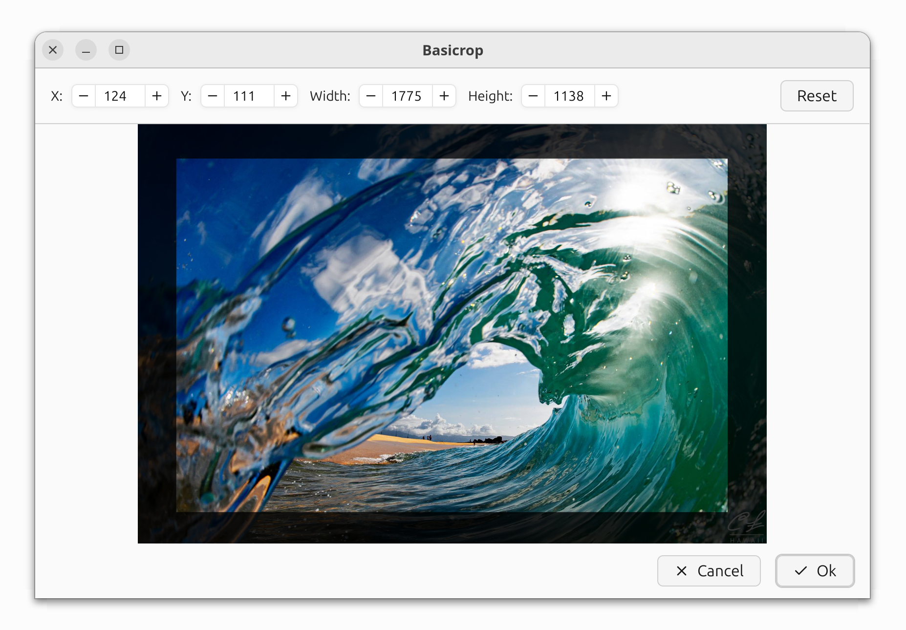

# Basicrop
Basic image cropping program made with GPUI



## Building
Get [Rust](https://www.rust-lang.org/tools/install) if you haven't already, then run:
```
cargo build --release
```

When it compiles succesfully you should find the compiled program available at
`./target/release/basicrop` (`basicrop.exe` on Windows).

# Credits
- Zed developers for [GPUI](https://www.gpui.rs/)
- Longbridge developers for [GPUI Component](https://longbridge.github.io/gpui-component/)
- [QCrop](https://gitlab.com/gregseth/qcrop) for original inspiration

# License
MIT